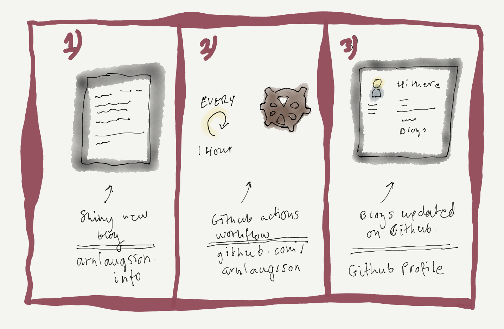

I joined the Github Actions Beta way back before it was released. I had done some experiments, but nothing noteworthy. But now that I have this blog, I wanted to put it to some use.

After some thinking, I decided to try out [Gautam krisha R's](https://github.com/gautamkrishnar) Github Action workflow, [Blog post workflow](https://github.com/gautamkrishnar/blog-post-workflow).

Since I was already using the Eleventy starter blog template, setup was straightforward. Eleventy has a plugin for the feed, [RSS feed](https://www.11ty.dev/docs/plugins/rss/), so it was just a matter of piecing things together.

I was expecting it to be more of a hassle, but it was just super simple.
